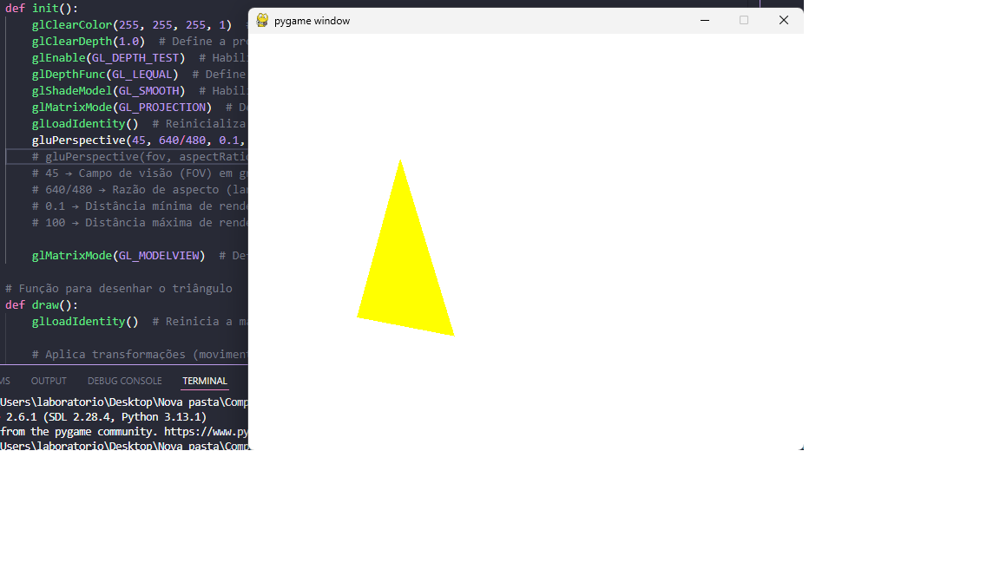
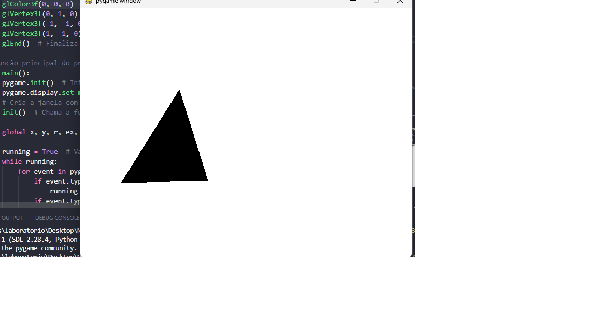
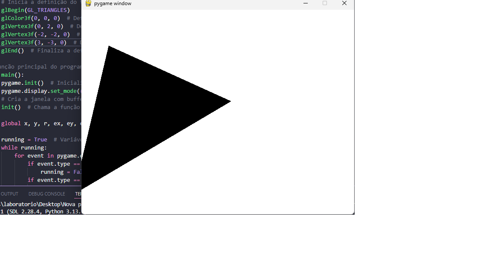
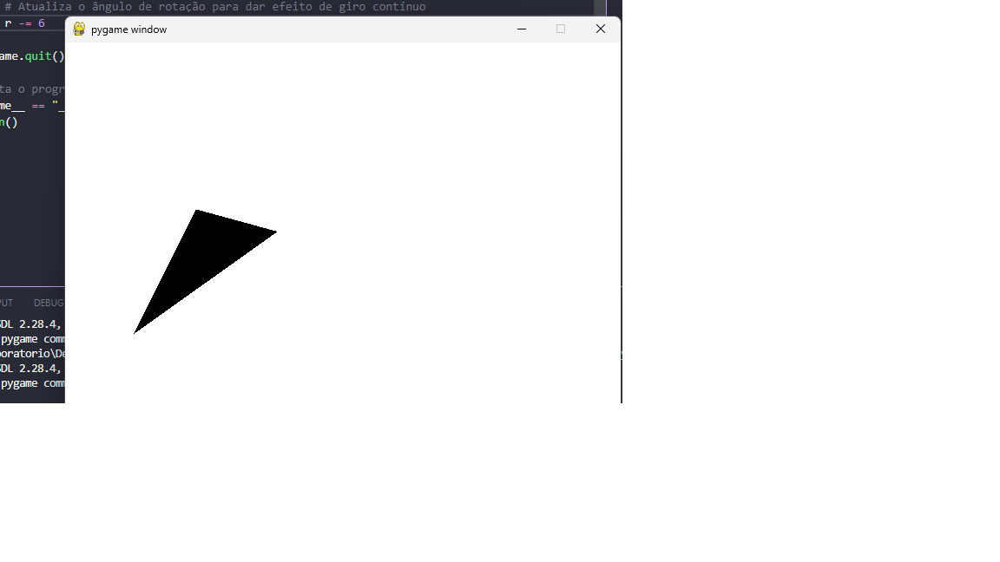
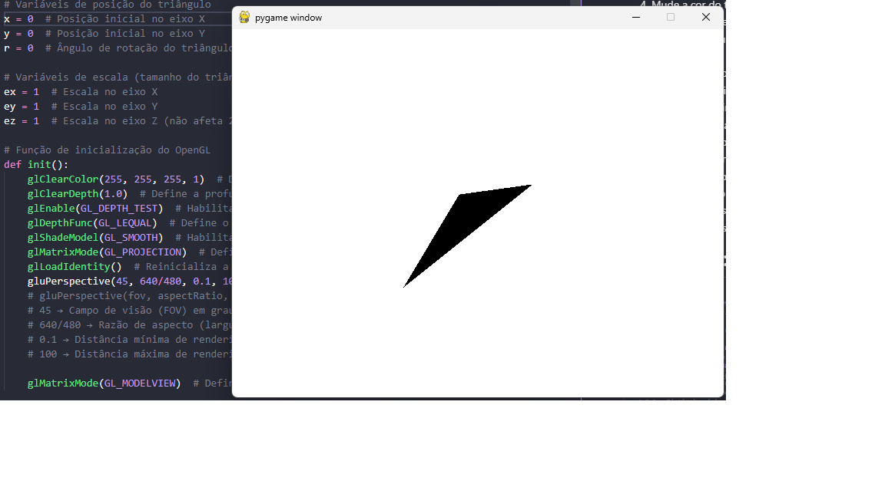
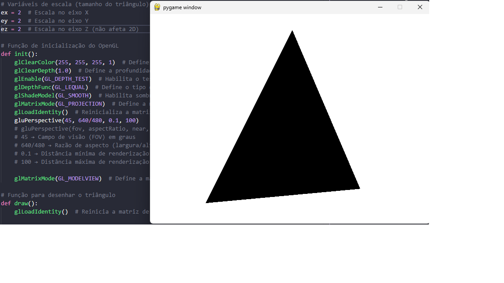
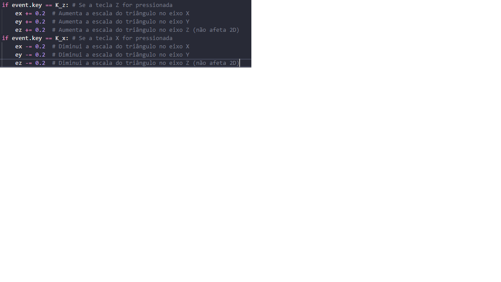

### Agora vamos treinar os nossos conceitos e fazer algumas modificações (Responda as perguntas e onde foi necessário alterar o código. A resposta deve ser enviada na atividade da aula (pdf)
1) Mude a cor de fundo para branco
2) Mude a rotação do eixo Y para o eixo X e veja o que acontece
3) Agora muda a rotação do eixo Y para o eixo X e Y e veja o que acontece
4) Mude a cor do triangulo para preto
5) Altere os vértices X, Y para um número maior e teste o triangulo
6) Atualize o ângulo de rotação para girar mais rápido para o lado esquerdo
Ou no sentido horário. (OBS: no código original ele gira anti-horário). O que precisou ser alterado?
7) Altere a posição inicial do triângulo. Atualmente, ele inicia em x = -1.5 e y = 0.
Modifique para que ele comece centralizado (x = 0, y = 0).
O que acontece com a exibição ao iniciar?
8) Mude a escala inicial do triângulo
No código original, ex = 1, ey = 1, ez = 1.
Altere para ex = 2, ey = 2, ez = 2.
Como a mudança da escala afeta a exibição do triângulo?
9) Modifique a movimentação do triângulo
No código original, pressionar A move para a esquerda e D move para a direita.
Inverta os controles para que A mova para a direita e D mova para a esquerda.
Explique o que foi alterado no código para isso acontecer.
10) Adicione um controle de zoom com as teclas "Z" e "X"
O objetivo deste exercício é permitir que o usuário aproxime e afaste o triângulo usando as teclas:
"Z" para aproximar (trazendo o triângulo para frente no eixo Z).
"X" para afastar (empurrando o triângulo para trás no eixo Z).

# Resposta 1:

# Resposta 2:
 p/ glRotatef(r, 1, 0, 0) ")

# Resposta 3:
 p/ glRotatef(r, 1, 1, 0) ")

# Resposta 4:

# Resposta 5:

# Resposta 6:

# Resposta 7:

# Resposta 8:

# Resposta 9:
")

# Resposta 10:
